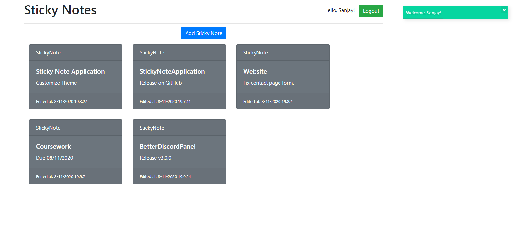

<!-- PROJECT LOGO -->
<br />
<p align="center">
  <a href="https://github.com/sanjaysunil/StickyNotes">
    
  </a>

  <h1 align="center">StickyNotes</h1>

  <p align="center">
    Organize tasks efficiently with StickyNotes!
    <br />
    <br />
    <a href="https://github.com/sanjaysunil/StickyNotes/issues/new?assignees=&labels=Bug&template=bug_report.md&title=%5BBUG%5D">Report Bug</a>
    ·
    <a href="https://github.com/sanjaysunil/StickyNotes/issues/new?assignees=&labels=Suggestions&template=suggestions.md&title=%5BSUGGESTION%5D">Request Feature</a>
  </p>
</p>

<!-- TABLE OF CONTENTS -->

## Table of Contents

- [About the Project](#about-the-project)
- [Features](#features)
- [Getting Started](#getting-started)
- [Installation](#installation)
- [Roadmap](#roadmap)
- [Contributing](#contributing)
- [License](#license)
- [Built With](#built-with)
- [Contact](#contact)

<!-- ABOUT THE PROJECT -->

## About The Project



**StickyNotes** is an innovative web application made with Firebase to help you organize your tasks.

## Features

**Current Features:**

- Login to your personal account
- Signup with a new Account
- Add new StickyNote
- All StickyNotes saved into unique stores in Realtime Database

**Coming Soon:**

- Delete StickyNotes
- More StickyNote Personalization
- Settings

## Getting Started

1. Clone the repo

```sh
git clone https://github.com/sanjaysunil/StickyNotes
```

2. Open `index.html` to open StickyNotes.

3. Create an account or login to your account.

4. Start using StickyNotes!

## Installation

1. Clone the repo

```sh
git clone https://github.com/sanjaysunil/StickyNotes
```

2. Open <a href="https://firebase.google.com" target="blank">Firebase Console</a> and open console with a new created Firebase Project.
3. Obtain your Firebase app credentials and replace with the credentials located in `js/index.js`

```
  var config = {
    apiKey: "",
    authDomain: "",
    databaseURL: "",
    projectId: "",
    storageBucket: "",
    messagingSenderId: "",
    appId: ""
  };
  firebase.initializeApp(config);
```

4. Go to the Authentication section of your project and enable Email/Password Signin as a sign up method.
5. Go to the Realtime Database section of your project and create a new database in test mode.
6. Open StickyNotes, create an account and start organizing tasks!
<!-- ROADMAP -->

## Roadmap

See the [open issues](https://github.com/sanjaysunil/StickyNotes/issues) for a list of proposed features (and known issues).

<!-- CONTRIBUTING -->

## Contributing

Contributions are what make the open source community such an amazing place to be learn, inspire, and create. Any contributions you make are **greatly appreciated**.

1. Fork the Project
2. Create your Feature Branch (`git checkout -b feature/AmazingFeature`)
3. Commit your Changes (`git commit -m 'Add some AmazingFeature'`)
4. Push to the Branch (`git push origin feature/AmazingFeature`)
5. Open a Pull Request

<!-- LICENSE -->

## License

Distributed under the MIT License. See `LICENSE` for more information.

### Built With

- [jQuery](https://jquery.com)
- [Firebase](https://firebase.google.com)

---

<div align="center">

## Contact

Website : [sanjaysunil.me](https://sanjaysunil.me) &nbsp;&middot;&nbsp;
Email : [sanjaysunil@protonmail.com](mailto:sanjaysunil@protonmail.com) &nbsp;&middot;&nbsp;
Discord : [D3VSJ#3158](https://discordapp.com/users/732336924559278181)

</div>
